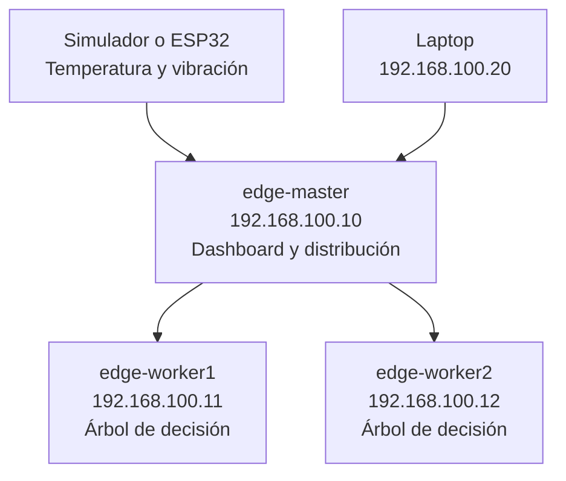

# Diagrama de la arquitectura

```mermaid
flowchart TD
    S["Simulador o ESP32\nTemperatura y vibración"] --> M["edge-master\n192.168.100.10\nDashboard y distribución"]
    M --> W1["edge-worker1\n192.168.100.11\nÁrbol de decisión"]
    M --> W2["edge-worker2\n192.168.100.12\nÁrbol de decisión"]
    L["Laptop\n192.168.100.20"] --> M
```

El cable WAN del ER605 se desconecta durante la demostración. La red, el modelo y la inferencia permanecen locales.
